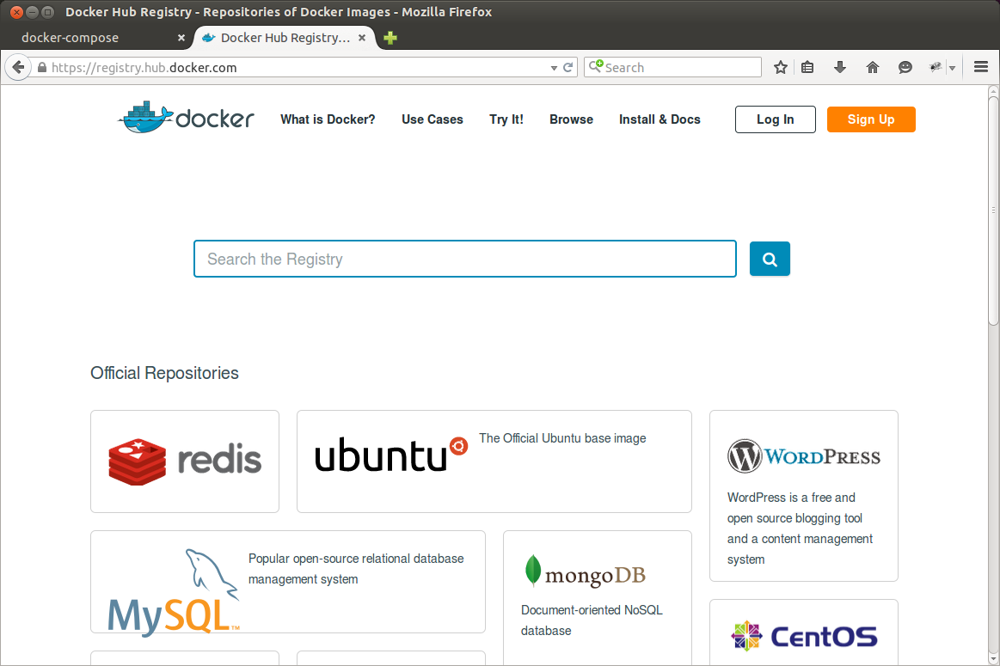

:title: docker-compose
:author: Fernando Espíndola
:description: docker-compose
:css: stylesheet.css

----

Docker Compose
==============

.. image:: images/docker-logo.png
    :height: 600px

----

Docker Compose
==============

* Compose is a tool for defining and running complex applications with Docker.
* define your containers in simples YAML file.
* Originated from Fig

----

Example
=======

  * Dependecies 

      * MySQL
      * Redis
      * MongoDB

----

Docker Hub Registry
===================

https://registry.hub.docker.com/

----

docker-compose.yml
==================

MySQL
-----

.. code:: yaml

  mysql:
    image: mysql:5.6.24
    volumes:
      - ~/.docker/boletos/mysql:/var/lib/mysql
    environment:
      - MYSQL_DATABASE=boletos
      - MYSQL_ROOT_PASSWORD=password

----

docker-compose.yml
==================

MongoDB
-------

.. code:: yaml

  mongo:
    image: mongo:3.0.2
    volumes:
      - ~/.docker/boletos/mongo:/data/db

----

docker-compose.yml
==================

Redis
-----

.. code:: yaml

  redis:
    image: redis:2.8.19
    volumes:
      - ~/.docker/boletos/redis:/data

----

docker-compose.yml
==================

App
---

.. code:: yaml

  boletos:
    build: .
    command: uwsgi --ini uwsgi.ini
    links:
      - mysql
      - redis
      - mongo

----

docker-compose.yml
==================

Celery
------

.. code:: yaml

  celery:
    build: .
    command: celery -A boletos worker -l info -B
    links:
      - mysql
      - redis
      - mongo

----

Dockerfile
==========

.. code:: docker

  FROM ubuntu:14.04.2
  MAINTAINER  fer.esp@gmail.com

  RUN apt-get update

  RUN apt-get -y install build-essential
  RUN apt-get -y install make
  RUN apt-get -y install gcc
  RUN apt-get -y install git
  RUN apt-get -y install libmysqlclient-dev
  RUN apt-get -y install python
  RUN apt-get -y install python-dev
  RUN apt-get -y install python-pip
  RUN apt-get -y install python-setuptools
  RUN apt-get -y install python-virtualenv
  RUN apt-get -y install vim

  RUN apt-get -y autoremove
  RUN apt-get -y autoclean
  RUN apt-get -y clean

  WORKDIR /app

----

Putting It All Together
=======================

Build
-----

.. code:: shell

  $ docker-compose build

Running
-------

.. code:: shell

  $ docker-compose up
